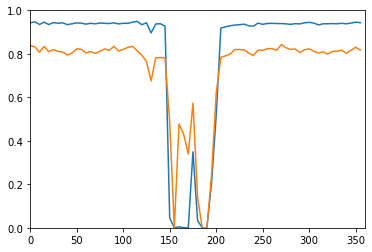

# Model Interpretation through Sensitivity Analysis for Segmentation
> Interpret and explain your segmetation models through analysing their sensitivity to defined alterations of the input


Input alterations currently include:
 - rotation
 - cropping

## Install

`pip install misas`

## How to use

Example with kaggle data

```python
from fastai.vision import *
```

```python
#hide_output
img = lambda: open_image("example/kaggle/images/1-frame014-slice005.png")
trueMask = lambda: open_mask("example/kaggle/masks/1-frame014-slice005.png")
trainedModel = Fastai1_model('chfc-cmi/cmr-seg-tl', 'cmr_seg_base')
img().show(y=trueMask(), figsize=(8,8))
```

### Rotation

```python
plot_series(get_rotation_series(img(), trainedModel))
```


```python
results = eval_rotation_series(img(), trueMask(), trainedModel)
plt.plot(results['deg'], results['c1'])
plt.plot(results['deg'], results['c2'])
plt.axis([0,360,0,1])
```


    [0, 360, 0, 1]





You can use interactive elements to manually explore the impact of rotation

```python
from ipywidgets import interact, interactive, fixed, interact_manual
import ipywidgets as widgets
```

```python
rotation_series = get_rotation_series(img(),trainedModel,step=10)
```

```python
def plot_rotation_frame(deg):
    return plot_frame(*rotation_series[int(deg/10)], figsize=(10,10))
```

```python
#hide_output
interact(
    plot_rotation_frame,
    deg=widgets.IntSlider(min=0, max=360, step=10, value=90, continuous_update=False)
)
```

There are lots of other transformations to try (e.g. cropping, brightness, contrast, ...). For a complete list see the local_interpret documentation.
