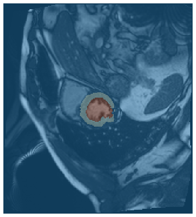
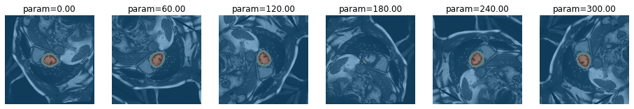

# Model Interpretation through Sensitivity Analysis for Segmentation
> Interpret and explain your segmetation models through analysing their sensitivity to defined alterations of the input


Input alterations currently include:
 - rotation
 - cropping

## Install

`pip install misas`

## How to use

Example with kaggle data

```python
from fastai.vision import *
```

```python
img = lambda: open_image("example/kaggle/images/1-frame014-slice005.png")
trueMask = lambda: open_mask("example/kaggle/masks/1-frame014-slice005.png")
trainedModel = load_learner(path="example/kaggle", file="model.pkl", tfm_y=False)
img().show(y=trueMask(), figsize=(8,8))
```





### Rotation

```python
plot_rotation_series(img(), trainedModel)
```





```python
results = rotation_series(img, trueMask, trainedModel)
plt.plot(results['deg'], results['diceLV'])
plt.plot(results['deg'], results['diceMY'])
plt.axis([0,360,0,1])
```

    


    [0, 360, 0, 1]


You can use interactive elements to manually explore the impact of rotation

```python
from ipywidgets import interact, interactive, fixed, interact_manual
import ipywidgets as widgets
```

```python
interact(
    plot_rotation,
    image_function=fixed(img),
    model=fixed(trainedModel),
    deg=widgets.IntSlider(min=0, max=360, step=10, value=90, continuous_update=False)
)
```


    <function misas.core.plot_rotation(image_function, model, deg=90)>


### Cropping

```python
plot_crop_series(img(), trainedModel)
```


```python
results = crop_series(img, trueMask, trainedModel)
plt.plot(results['pxls'], results['diceLV'])
plt.plot(results['pxls'], results['diceMY'])
plt.axis([32,256,0,1])
```

    


    [32, 256, 0, 1]


```python
interact(
    plot_crop,
    image_function=fixed(img),
    model=fixed(trainedModel),
    pxls=widgets.IntSlider(min=10, max=256, step=2, value=76, continuous_update=False),
    figsize=fixed((10,10))
)
```


    <function misas.core.plot_crop(image_function, model, pxls, **kwargs)>


