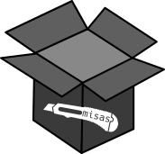
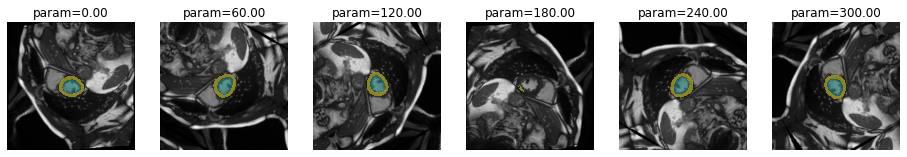
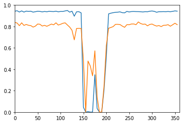
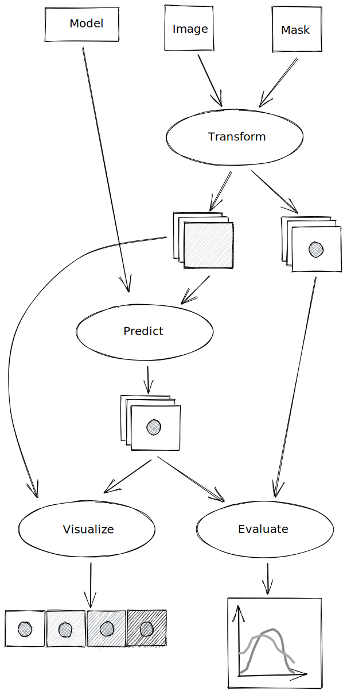

# Model Interpretation through Sensitivity Analysis for Segmentation
> Interpret and explain your segmetation models through analysing their sensitivity to defined alterations of the input




Input alterations currently include:
 - rotation
 - cropping

## Install

`pip install misas`

## How to use

Example with kaggle data

```python
from fastai.vision import *
from misas.core import default_cmap
```

```python
#hide_output
img = lambda: open_image("example/kaggle/images/1-frame014-slice005.png")
trueMask = lambda: open_mask("example/kaggle/masks/1-frame014-slice005.png")
trainedModel = Fastai1_model('chfc-cmi/cmr-seg-tl', 'cmr_seg_base')
fig, ax = plt.subplots(figsize=(8,8))
img().show(ax=ax)
trueMask().show(ax=ax, cmap=default_cmap)
```

### Rotation

```python
plot_series(get_rotation_series(img(), trainedModel))
```





```python
results = eval_rotation_series(img(), trueMask(), trainedModel)
plt.plot(results['deg'], results['c1'])
plt.plot(results['deg'], results['c2'])
plt.axis([0,360,0,1])
```


    (0.0, 360.0, 0.0, 1.0)





You can use interactive elements to manually explore the impact of rotation

```python
from ipywidgets import interact, interactive, fixed, interact_manual
import ipywidgets as widgets
```

```python
rotation_series = get_rotation_series(img(),trainedModel,step=10)
```

```python
def plot_rotation_frame(deg):
    return plot_frame(*rotation_series[int(deg/10)], figsize=(10,10))
```

```python
#hide_output
interact(
    plot_rotation_frame,
    deg=widgets.IntSlider(min=0, max=360, step=10, value=90, continuous_update=False)
)
```

There are lots of other transformations to try (e.g. cropping, brightness, contrast, ...) as well as MR specific artifacts.

## Overview

This is the schematic overview of how `misas` works. Created with the amazing [Excalidraw](https://excalidraw.com/).


## Logo

The logo was designed by Markus J. Ankenbrand using:
 - [Open box / Boite ouverte](https://openclipart.org/detail/29155/open-box-boite-ouverte) by [SimpleIcons](https://openclipart.org/artist/SimpleIcons) via [openclipart.org](https://openclipart.org)
 - [Cutter icon](https://openclipart.org/detail/213227/cutter-icon) by [SimpleIcons](https://openclipart.org/artist/SimpleIcons) via [openclipart.org](https://openclipart.org), original by Marco Olgio, via [WikiMedia](commons.wikimedia.org/wiki/File:Utility_Knife_by_Marco_Olgio.svg)
 - [Hack Font](https://sourcefoundry.org/hack/)
 - [Inkscape](https://inkscape.org)
 


## Attribution

This project is inspired by the awesome ["Is it a Duck or Rabbit" tweet](https://twitter.com/minimaxir/status/1103676561809539072) by [@minimaxir](https://twitter.com/minimaxir). Also check out the [corresponding repo](https://github.com/minimaxir/optillusion-animation).


```python
%%html
<blockquote class="twitter-tweet"><p lang="en" dir="ltr">Is it a Duck or a Rabbit? For Google Cloud Vision, it depends how the image is rotated. <a href="https://t.co/a30VzjEXVv">pic.twitter.com/a30VzjEXVv</a></p>&mdash; Max Woolf (@minimaxir) <a href="https://twitter.com/minimaxir/status/1103676561809539072?ref_src=twsrc%5Etfw">March 7, 2019</a></blockquote> <script async src="https://platform.twitter.com/widgets.js" charset="utf-8"></script> 
```


<blockquote class="twitter-tweet"><p lang="en" dir="ltr">Is it a Duck or a Rabbit? For Google Cloud Vision, it depends how the image is rotated. <a href="https://t.co/a30VzjEXVv">pic.twitter.com/a30VzjEXVv</a></p>&mdash; Max Woolf (@minimaxir) <a href="https://twitter.com/minimaxir/status/1103676561809539072?ref_src=twsrc%5Etfw">March 7, 2019</a></blockquote> <script async src="https://platform.twitter.com/widgets.js" charset="utf-8"></script> 


